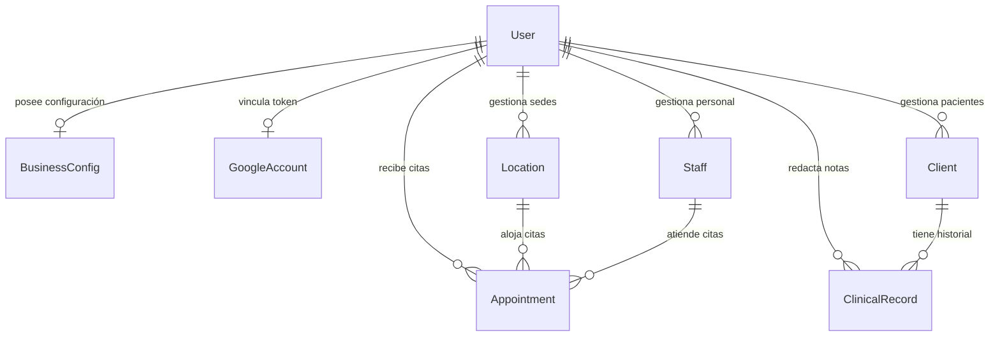

# Arquitectura, Módulos y Análisis Técnico del Sistema "My Appointment"

> **Documento de Contexto Técnico y Estratégico Integral**  
> Diseñado para auditoría de código, evaluación arquitectónica y planificación de producto mediante modelos de Inteligencia Artificial (Claude, GPT, o1, etc.).

---

## 1. Resumen Ejecutivo y Objetivo del Producto

**My Appointment** es una plataforma SaaS (*Software as a Service*) B2B de agendamiento inteligente, gestión de pacientes (CRM Clínico) y cobros de autoservicio, diseñada específicamente para profesionales independientes, clínicas y centros de salud/terapia (con enfoque optimizado para **psicólogos, médicos, terapeutas y consultores**).

### Objetivos Clave del Negocio:
1. **Autonomía del Paciente**: Permitir que los pacientes agenden citas directamente desde una página pública personalizada (`clinica-araujo.tudominio.com`) sin requerir registro ni inicio de sesión.
2. **Reducción de Ausentismo (*No-Shows*)**: Sincronización en tiempo real con Google Calendar, control de pagos por transferencia bancaria (subida de comprobante) y soporte para recordatorios automatizados.
3. **Expediente Clínico Asistido por IA**: Registro de consultas con estructuración automática en formato médico/psicológico **SOAP** (Subjetivo, Objetivo, Análisis, Plan) utilizando **Google Gemini AI**.
4. **Multi-Tenancy Nativo y Marca Blanca**: Cada profesional opera en su propio subdominio web, con su propia identidad visual, configuración de servicios, sedes físicas y staff colaborador.

---

## 2. Stack Tecnológico

| Capa | Tecnología | Detalle de Implementación |
| :--- | :--- | :--- |
| **Framework Web** | Next.js 16.2+ (App Router & Turbopack) | Arquitectura híbrida Server/Client Components, React 19, Server Actions (`/actions`) y Route Handlers (`/api`). |
| **Estilos & UI System** | Tailwind CSS v4 & CSS Utilities | Sistema de diseño propietario **"Liquid Glass"** (estética macOS Sequoia / iOS 26 en Modo Claro, desenfoque esmerilado `backdrop-blur-xl`, sombras de bisel refractivo `inset`, tipografía SF Pro y acento Apple Blue `#007AFF`). |
| **Base de Datos** | PostgreSQL (en Supabase Pooler) | Conexión transaccional y pooler optimizado (`aws-1-us-east-2.pooler.supabase.com:5432`). |
| **ORM & Modelado** | Prisma ORM 6.x | Definición de esquemas, migraciones y tipado estricto TypeScript para todas las consultas. |
| **Autenticación** | Supabase Auth (SSR Cookies) | Control de sesiones seguras mediante `@supabase/ssr` en Server Components y Middleware. Soporta Email/Password y Google OAuth 2.0. |
| **Motor de Inteligencia Artificial** | Google Gemini API (1.5 Flash) | Endpoint `/api/ai/clinical-notes` para transformación de notas clínicas desestructuradas en notas SOAP formales. |
| **Integración de Calendarios** | Google Calendar API (`googleapis`) | Sincronización bidireccional vía OAuth 2.0 (lectura de disponibilidad ocupada y escritura en espejo de eventos reservados). |
| **Pasarelas de Pago** | Transferencia Bancaria Manual + Wompi | Flujo de subida y verificación de comprobantes bancarios (CLABE/CBU) y scaffolding para pasarela Wompi. |

---

## 3. Arquitectura Multi-Tenant y Enrutamiento por Subdominios

El sistema implementa una arquitectura **Multi-Tenant dinámica por subdominios** a través del Middleware de Next.js (`middleware.ts`):

```
                       Petición Entrante (HTTP)
                                  │
                                  ▼
                   ┌──────────────────────────────┐
                   │  middleware.ts (NextRequest) │
                   └──────────────┬───────────────┘
                                  │
         ┌────────────────────────┴────────────────────────┐
         │                                                 │
  Dominio Principal                                 Subdominio Tenant
  (ej. tudominio.com / localhost)                   (ej. clinica-araujo.tudominio.com)
         │                                                 │
  ┌──────┴───────────────────────┐                  ┌──────┴──────────────────────┐
  │ Rutas del Sistema:           │                  │ Rewrite Interno de Ruta:    │
  │ • / (Landing Page)           │                  │ • /_tenant/[subdomain]      │
  │ • /login & /signup           │                  │ • /_tenant/[subdomain]/[staff]
  │ • /onboarding                │                  │                             │
  │ • /dashboard/* (Backoffice)  │                  │ Carga el Portal de Reserva  │
  │ • /admin/* (Super Admin)     │                  │ Público sin pedir Login     │
  └──────────────────────────────┘                  └─────────────────────────────┘
```

### Características del Enrutamiento:
* **Sanitización de Dominio**: El Middleware limpia comillas o puertos y extrae el slug (`subdomain = hostname.replace(.ROOT_DOMAIN)`).
* **Acceso Público Inmediato**: En subdominios de tenant, el Middleware no bloquea la navegación pública a la raíz (`/`), permitiendo al paciente agendar inmediatamente.
* **Redirección de Compatibilidad**: La ruta `/[slug]` actúa como fallback, redirigiendo con código 307 al subdominio formal del profesional.

---

## 4. Desglose Detallado Módulo por Módulo

### 4.1. Portal Público de Agendamiento del Paciente (`/_tenant/[subdomain]`)
Es la interfaz donde interactúa el paciente. Su flujo consta de un asistente visual inteligente:
1. **Detección y Carga de Identidad**: Obtiene la información del profesional mediante `prisma.user.findUnique({ where: { slug } })` con su configuración de marca, descripción, avatar y zona horaria.
2. **Stepper Adaptativo**:
   * **Sede (Opcional)**: Se activa automáticamente si el profesional configuró más de 1 ubicación física.
   * **Especialista (Opcional)**: Se activa si el profesional tiene colaboradores activos en su plan PRO.
   * **Selector de Fecha**: Calendario interactivo mensual (`MonthCalendar`) que deshabilita días pasados y días no laborables.
   * **Cálculo de Horarios en Tiempo Real**: El backend (`getAvailableSlots`) calcula los bloques libres de acuerdo a la duración del servicio (`slotDuration`), tiempos de holgura (`bufferTime`), citas previas en base de datos y eventos ocupados en Google Calendar.
   * **Cuestionario Dinámico (`DynamicBookingForm`)**: Solicita nombre, email, teléfono y campos personalizados definidos por el terapeuta (ej. "Motivo de consulta", "¿Es primera vez?").
   * **Cumplimiento de Privacidad**: Casilla obligatoria (`required`) de aceptación del Aviso de Privacidad con enlace directo a `/privacy-notice.html`.
3. **Confirmación y Pago**:
   * Si la cita requiere transferencia bancaria, se muestran los datos (Banco, CLABE/Cuenta, Titular, Instrucciones) y una zona para arrastrar y subir el comprobante de pago (`uploadPaymentProofAction`).
   * Permite al paciente añadir el evento a Google Calendar o descargar el archivo universal `.ics` (Apple Calendar / Outlook).

---

### 4.2. Flujo de Autenticación y Onboarding

#### A. Autenticación (`/login`, `/signup`, `/forgot-password`, `/reset-password`)
* Construido con **Supabase SSR Client**.
* Manejo seguro de cookies de sesión con redirección automática a `/dashboard` si el usuario ya está autenticado.
* Recuperación de contraseña mediante correo electrónico y confirmación de nueva clave.
* Soporte nativo para inicio de sesión con Google OAuth 2.0.

#### B. Onboarding Wizard (`/onboarding` & `OnboardingWizardPremium`)
Si un usuario registrado aún no tiene su registro en `BusinessConfig`, es guiado por un asistente de configuración de 5 pasos:
1. **Identidad del Negocio**: Nombre comercial, slug único para su subdominio (ej: `psicologia-maria`) y rubro profesional (`PSICOLOGIA`, `MEDICINA`, `CONSULTORIA`, etc.).
2. **Duración y Servicios**: Definición del tiempo base por sesión (15, 30, 45, 60, 90 minutos) y zona horaria.
3. **Horarios Laborales Semanales**: Configuración de intervalos de atención por cada día de la semana (soporta múltiples turnos, ej: mañana y tarde).
4. **Métodos de Pago**: Activación de transferencias bancarias con datos de depósito y número de WhatsApp para atención directa.
5. **Generación de Enlace**: Creación de la configuración en la base de datos y redirección al Dashboard.

---

### 4.3. Panel de Control Administrativo (Backoffice `/dashboard`)

#### A. Vista General (`/dashboard/page.tsx`)
* **Tarjetas de Métricas Clave**: Total de Citas, Total de Clientes, Citas Pendientes de Validación y Citas de la Semana.
* **Agenda de Hoy**: Línea de tiempo cronológica con indicadores de estado de color, datos de contacto del paciente y tipo de consulta.
* **Widget de Enlace Público**: Muestra el subdominio del terapeuta con botón para copiar al portapapeles y probar la vista del paciente.
* **Acciones Rápidas**: Accesos directos a crear citas manuales, revisar pagos y ver reportes.

#### B. Calendario y Agenda Interactiva (`/dashboard/citas`)
* **Vistas Dinámicas**: Modo **Día** (timeline cronológico por horas con línea roja de hora actual), Modo **Semana** y Modo **Mes**.
* **Mini Calendario Lateral**: Navegador visual rápido con puntos indicadores en fechas con citas.
* **Gestión de Citas**: Al hacer clic en cualquier cita, se abre un cajón lateral (*drawer modal*) para:
  * Cambiar el estado: `CONFIRMADA`, `PENDIENTE`, `CANCELADA`.
  * Iniciar conversación directa de WhatsApp con el paciente.
  * Ver respuestas al cuestionario dinámico.
* **Agendamiento Manual**: Formulario para registrar pacientes que solicitan cita por llamada o mensaje privado.

#### C. CRM de Pacientes y Expediente Clínico con IA (`/dashboard/clientes`)
* **Directorio Unificado**: Listado de todos los pacientes que han reservado o han sido dados de alta manualmente.
* **Búsqueda en Tiempo Real**: Filtrado instantáneo por nombre, teléfono o email.
* **Expediente Clínico (`ClinicalRecord`)**:
  * Pestaña de historial de consultas y sesiones del paciente.
  * **Asistente de Notas Clínicas con IA**: El terapeuta puede escribir notas rápidas o viñetas desordenadas de la sesión y presionar **"Estructurar con IA"**. La API de Gemini (`/api/ai/clinical-notes`) procesa el texto y genera automáticamente una nota estructurada formal en formato **SOAP**:
    * **S (Subjetivo)**: Lo que el paciente refiere, estado de ánimo y motivo reportado.
    * **O (Objetivo)**: Observaciones clínicas del terapeuta, lenguaje no verbal, afecto.
    * **A (Análisis/Evaluación)**: Interpretación profesional del avance o dificultades.
    * **P (Plan)**: Tareas acordadas, objetivos terapéuticos para la próxima sesión y recomendaciones.

#### D. Verificación de Pagos y Transferencias (`/dashboard/pagos`)
* **Bandeja de Aprobación**: Lista de citas pagadas por transferencia bancaria que requieren validación.
* **Previsualización de Comprobante**: Muestra la imagen del ticket/voucher bancario adjuntado por el paciente.
* **Acciones de Validación**: Botones de un clic para **Aprobar Pago** (cambia la cita a `CONFIRMADA` y el pago a `PAGADO`) o **Rechazar**.

#### E. Configuraciones Generales (`/dashboard/settings`)
Estructurado al estilo *macOS System Settings* con pestañas verticales:
* **Perfil Público**: Nombre, foto de perfil/avatar, descripción, rubro y zona horaria.
* **Horarios y Disponibilidad**: Editor interactivo de turnos semanales y duración de consulta.
* **Formularios Dinámicos**: Constructor de preguntas personalizadas para el agendamiento.
* **Métodos de Cobro**: Configuración de banco, titular, CLABE/cuenta e instrucciones.
* **Integraciones**: Conexión con Google Calendar y WhatsApp.
* **Plan & Facturación**: Visualización del nivel de suscripción actual (FREE o PRO).

#### F. Gestión de Personal y Sedes (`/dashboard/personal` & `/dashboard/sedes`)
* **Sedes Físicas (`Location`)**: Creación de sucursales o consultorios con nombre, dirección y teléfono.
* **Especialistas (`Staff`)**: Alta de psicólogos o colaboradores con su propio horario laboral independiente, avatar y descripción.

---

### 4.4. Panel de Super Administración (`/admin`)
* **Gestión de Tenants (`/admin/tenants`)**: Vista global de todos los profesionales registrados en la plataforma.
* **Control de Ingresos (`/admin/revenue`)**: Métricas de cobro y planes contratados.

---

## 5. Modelo de Datos (Prisma Schema)



### Entidades Principales:
* **`User`**: Cuenta del profesional/clínica (rol `TENANT` o `ADMIN`, nivel `PlanTier` FREE o PRO, slug para subdominio).
* **`BusinessConfig`**: Horarios semanales (`weeklyHours` en JSON), duración (`slotDuration`), holgura (`bufferTime`), preguntas del cuestionario (`formFields` en JSON) y datos bancarios.
* **`Appointment`**: Reserva con fecha/hora (`startTime`, `endTime`), estado (`PENDIENTE`, `CONFIRMADA`, `CANCELADA`), estado de pago (`paymentStatus`), URL del comprobante (`paymentProofUrl`) y relación opcional con Sede y Staff.
* **`Client`**: Registro único del paciente por profesional (nombre, email, teléfono, notas generales).
* **`ClinicalRecord`**: Ficha médica/psicológica del paciente con tipo (`EVOLUCION`, `NOTA`, `CONSENTIMIENTO`) y contenido detallado (incluyendo notas SOAP estructuradas).
* **`Staff` & `Location`**: Modelos para soportar clínicas con múltiples consultorios y terapeutas asociados.
* **`GoogleAccount`**: Tokens OAuth (`accessToken`, `refreshToken`, `expiryDate`) para la sincronización con Google Calendar.

---

## 6. Seguridad, Privacidad y Cumplimiento Normativo

1. **Aislamiento Multi-Tenant (Data Isolation)**: Todas las consultas de datos en el backoffice y acciones del servidor están estrictamente filtradas por `userId` obtenido de la sesión autenticada.
2. **Consentimiento Informado**: El formulario de reservas integra una casilla obligatoria de consentimiento y aceptación del Aviso de Privacidad (`/privacy-notice.html`).
3. **Privacidad de Expedientes Clínicos**: Las notas SOAP y registros de evolución no son accesibles desde ningún endpoint público ni por otros tenants.
4. **Tokens Seguros**: Los tokens de Google Calendar se almacenan en el backend y se actualizan automáticamente usando el *Refresh Token*.

---

## 7. Análisis de Fortalezas, Oportunidades y Deuda Técnica

### 🌟 Fortalezas del Proyecto:
* **Diseño Excepcional**: La interfaz "Liquid Glass" en modo claro brinda una experiencia de usuario sumamente pulida, moderna y diferenciada de la competencia (estilo Apple nativo).
* **Multi-Tenant Real**: Enrutamiento automático por subdominios sin necesidad de infraestructura compleja adicional.
* **Valor Agregado Clínico (IA)**: La estructuración SOAP mediante Gemini ahorra hasta 10 minutos por consulta a los terapeutas.
* **Código Tipado y Modular**: 100% TypeScript con Server Actions de Next.js y validación estricta de esquemas.

### ⚠️ Aspectos a Considerar / Deuda Técnica:
1. **Automatización de Notificaciones de WhatsApp**: Actualmente existe el campo `enableWhatsApp` y el botón de contacto directo, pero la integración con una API de mensajería automatizada (como Twilio o Evolution API) para recordatorios cronometrados está lista para ser conectada.
2. **Certificados Wildcard SSL en Producción**: Al desplegar en la nube (Vercel, AWS, etc.), se requiere configurar un dominio con soporte de subdominios comodín (`*.tudominio.com`).
3. **Migración de Subida de Archivos**: Los comprobantes de pago actualmente usan almacenamiento local/base64; se recomienda conectar un Bucket de Supabase Storage para producción a gran escala.

---

## 8. Preguntas Estratégicas para la IA de Análisis

Si vas a compartir este documento con otra IA para definir el rumbo de negocio, puedes plantearle las siguientes preguntas:

1. *¿Cuál es la mejor estrategia de monetización (Precios, Planes FREE vs PRO) para lanzar este SaaS a psicólogos y terapeutas independientes?*
2. *¿Qué funcionalidades adicionales de telemedicina o cobro (ej. videollamadas integradas, pasarelas de pago recurrentes) deberían priorizarse en la versión 1.1?*
3. *¿Cómo estructurar la estrategia de adquisición de clientes (Go-To-Market) dirigida a profesionales de la salud mental en Latinoamérica / España?*
4. *¿Qué requerimientos legales específicos de protección de datos de salud (tipo HIPAA o LOPD) deben reforzarse antes del lanzamiento masivo?*

---
*Documento compilado y verificado en producción.*
