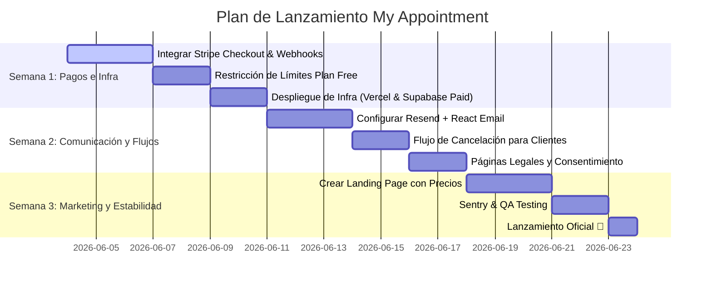

# Plan de Acción y Hoja de Ruta para Lanzamiento (SaaS)

Este documento detalla el análisis de la lista de verificación para el lanzamiento de **My Appointment** al mercado. Clasifica las tareas pendientes por nivel de criticidad (Bloqueantes, Recomendadas, Diferenciadores), propone arquitecturas de integración y define una hoja de ruta ágil.

---

## 1. Análisis de Estado Actual (Base Sólida)
El proyecto ya cuenta con una base sumamente madura en las funcionalidades principales de agendamiento (marcadas en **verde** en tu lista):
*   **Autenticación y Onboarding**: Flujo completo con Supabase y guardián de onboarding (slug, nombre, rubro).
*   **Calendario**: Vistas por Día/Semana/Mes, gestión de estados y agendamiento manual.
*   **CRM de Clientes**: Directorio paginado, fichas de clientes y guardado automático.
*   **Configuración**: Editor de horarios semanales, duración/buffer y constructor de formularios dinámicos.
*   **Portal Público**: Calendario interactivo en tiempo real con sincronización bidireccional con **Google Calendar** y token refresh automático.

---

## 2. Lo que Falta y Cómo Integrarlo (Prioridad 🔴 - Obligatorio para Lanzar)
Estas son las tareas críticas marcadas en rojo que deben estar listas antes de cobrar el primer peso.

### A. Pagos y Suscripciones (Stripe Integration)
Para monetizar la aplicación, se necesita cerrar la brecha del flujo de pagos.
*   **Cómo integrarlo**:
    1.  **Stripe Checkout**: Crear un endpoint API en Next.js (`/api/checkout`) que reciba el `priceId` y el `stripeCustomerId` del usuario, y devuelva la URL de Stripe Checkout.
    2.  **Stripe Webhooks**: Crear una ruta API de Next.js (`/api/webhooks/stripe`) con firma de seguridad verificada. Al recibir eventos como `customer.subscription.created` o `customer.subscription.deleted`, actualiza el `planTier` del `User` en Prisma a `PRO` o `FREE`.
    3.  **Límites de Plan Free**: En el backend de reservas (`createAppointment`), contar las citas del mes actual. Si el usuario es `FREE` y excede el límite (ej. 15 citas mensuales), rechazar la reserva y mostrar un modal de Upgrade.
    4.  **Customer Portal**: Un botón en la configuración para redirigir al usuario al Stripe Billing Portal para que administre su tarjeta o cancele su plan de manera automatizada.

### B. Emails Transaccionales (Transactional Emails)
Los clientes y profesionales necesitan confirmaciones inmediatas para que el negocio sea profesional.
*   **Cómo integrarlo**:
    1.  **Proveedor**: Usar **Resend** (con la librería `@react-email/components` para diseñar los correos en React). Es de bajo costo y fácil integración en Next.js.
    2.  **Emails a Enviar**:
        *   **Bienvenida**: Disparado desde Supabase Auth (verificación de correo) y un gancho de bienvenida de marca.
        *   **Nueva Reserva (Cliente)**: Detalla la fecha, hora, nombre del profesional y un enlace dinámico para cancelar la cita.
        *   **Nueva Cita (Profesional)**: Notifica al profesional con los detalles ingresados en el formulario dinámico.
        *   **Cancelación de Citas**: Alerta a ambas partes si un estado cambia a `CANCELADA`.

### C. Portal Público: Cancelación de Cita por el Cliente
Si el cliente final no puede asistir, debe poder cancelar la cita desde el correo de confirmación.
*   **Cómo integrarlo**:
    1.  Crear una ruta pública `/cancelar/[appointmentId]`.
    2.  Verificar que la cita exista y no haya pasado ya.
    3.  Actualizar el estado a `CANCELADA` en Prisma.
    4.  Si tiene Google Calendar activo, usar el `googleEventId` guardado en la cita para eliminar o actualizar el evento de Google mediante la API.

### D. Legal y Cumplimiento
Indispensable para evitar problemas legales al procesar información de contacto de clientes.
*   **Cómo integrarlo**:
    1.  Crear páginas estáticas `/terminos` y `/privacidad`.
    2.  Añadir un checkbox obligatorio de consentimiento de datos ("Acepto los términos de servicio y la política de privacidad") en el formulario de registro de profesionales y en el portal de reserva de clientes.

### E. Infraestructura y Producción
*   **Cómo integrarlo**:
    1.  **Dominio**: Comprar un dominio en Namecheap/GoDaddy e integrar con **Vercel** para hosting con certificado SSL automático gratuito.
    2.  **Supabase Pro**: Migrar de la versión gratuita a la versión de pago ($25/mes) para evitar que la base de datos o auth se pausen por inactividad y para contar con backups automáticos cada 24 horas.
    3.  **Monitoreo**: Configurar **Sentry** (Next.js SDK) para capturar bugs silenciosos en producción.

---

## 3. Lo que Viene Después (Prioridad 🟡 - Mes 1-2)
Para mejorar el producto una vez que ya esté en el mercado y reducir el abandono:

1.  **Múltiples Servicios**: Modificar el esquema Prisma para permitir que un profesional defina una tabla `Service` (nombre, duración, precio). El portal público primero preguntará qué servicio reservar antes de mostrar las horas disponibles.
2.  **Foto y Descripción Pública**: Agregar campos en el dashboard de configuración para subir un avatar y escribir una descripción corta, que se renderizará como cabecera en el portal de reserva `/[slug]`.
3.  **Días de Bloqueo / Vacaciones**: Permitir al profesional definir días completos donde no trabajará (ej. feriados o vacaciones), bloqueando la generación de slots en el portal.
4.  **Zonas Horarias Configurales**: Útil si el profesional trabaja de manera internacional (ej. psicólogos online).

---

## 4. Diferenciadores Premium (Prioridad 🔵 - Mes 2-3)
Características avanzadas que aumentarán el ticket promedio (LTV) y te permitirán cobrar más por el plan PRO:

1.  **Recordatorios por WhatsApp (Twilio)**:
    *   Integrar la API de Twilio o la API Cloud oficial de WhatsApp.
    *   Correr un cron job cada hora que busque citas programadas para las próximas 24 horas y envíe una plantilla de WhatsApp automatizada con botones de confirmación rápida ("Confirmar" / "Cancelar").
2.  **Pago en la Reserva**: Integrar Stripe en el portal del cliente final. El cliente debe pagar el valor de la sesión antes de confirmar la reserva, enviando los fondos directamente a la cuenta de Stripe Connect del profesional.
3.  **Widget Embebible**: Crear un snippet en Javascript (ej. un iframe interactivo) para que los profesionales puedan insertar el calendario de reservas directamente dentro de sus propios sitios web (WordPress, Wix, Squarespace).

---

## 5. Cronograma Recomendado de 3 Semanas para Lanzar

